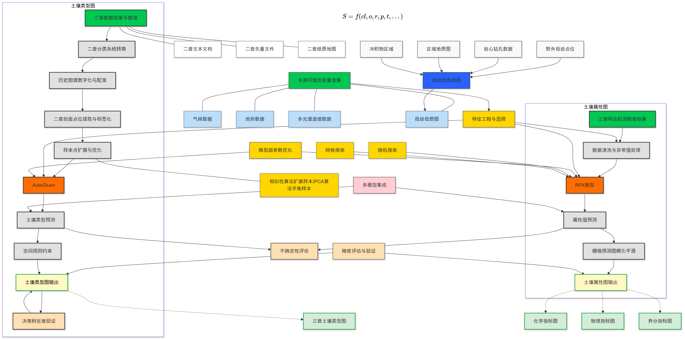

# 土壤数字制图项目

## 项目概述

本项目使用机器学习技术和地理信息系统（GIS）方法，基于经典的成土理论，通过整合多源遥感数据、地形数据、气候数据、母岩母质数据以及二普成果和第三次土壤普查调查数据，生成高精度的土壤属性和土壤类型空间分布图。致力于提供更精确、更全面的土壤空间信息。

## 理论基础

本项目的核心理论基础是 Jenny (1941) 提出的成土方程：

$S = f(cl, o, r, p, t, \ldots)$

其中：
- S: 土壤属性或类型
- cl: 气候（Climate）
- o: 生物（Organisms）
- r: 地形（Relief）
- p: 母质（Parent material）
- t: 时间（Time）
- ...: 其他潜在影响因素

通过对这些成土因子的量化分析和模型构建，我们可以更准确地预测和制图土壤属性与类型的空间分布

## 工作流程

项目的主要工作流程如下：

1. 数据收集与预处理
   - 遥感数据获取与处理
   - 环境协变量数据准备
   - 二普成果及三普调查数据
2. 特征工程
   - 特征提取和选择
   - 数据清洗
3. 模型训练
   - 土壤属性回归模型
   - 土壤属性分类模型
   - 土壤类型分类模型
4. 模型评估与优化
   - 模型评估
   - 参数调优
5. 空间预测与制图
   - 土壤属性预测图
   - 土壤属性预测不确定性图
   - 土壤类型预测图
   - 土壤类型预测不确定性图
6. 结果可视化与报告生成
   - 决策树可视化
   - 模型报告

详细的工作流程图如下：



## 项目结构

项目的文件结构如下：

```plaintext
soil-mapping/
│
├── data/
│   ├── raw/                 # 原始数据存储
│   ├── precessed/          # 预处理数据存储
│   ├── soil_type_table/     # 土壤类型表格数据存储
│   ├── soil_property_table/ # 土壤属性表格数据存储
│   ├── point_sample/        # 采样点数据存储
│   ├── polygon_sample/      # 多边形数据存储
│   ├── soil_property_predict/     # 土壤属性预测结果数据存储
│   ├── soil_type_predict/         # 土壤类型预测结果数据存储
│   ├── soil_property/       # 土壤属性特征数据存储
│   └── soil_type/           # 土壤类型特征数据存储
│
├── src/
│   ├── data/
│   │   ├── remote_sensing/   # 遥感数据处理
│   │   │   ├── download_gee.py  # 下载GEE数据(Sentinel-2多光谱数据）
│   │   │   ├── mosaic_raster_proj.py  # 栅格镶嵌和投影
│   │   │   ├── create_long_lat.py  # 创建经纬度栅格
│   │   │   ├── multiband_index_calculator.py  # 多波段指数计算
│   │   │   ├── clip_raster_aligin.py  # 栅格裁剪和对齐
│   │   │   └── check_raster.py  # 栅格检查
│   │   ├── data_cleaning/   # 数据清洗
│   │   │   └── data_cleaning.py  # 数据清洗脚本
│   │
│   ├── features/
│   │   ├── point_sample.py   # 点采样
│   │   └── polygon_sample.py # 多边形采样
│   │
│   ├── models/
│   │   ├── soil_property/   # 土壤属性模型
│   │   │   ├── train_soil_property.py # 训练土壤属性模型
│   │   │   ├── predict_soil_properties.py # 预测土壤属性
│   │   │   └── generate_soil_property_report.py # 生成土壤属性模型预测报告
│   │   └── soil_type/       # 土壤类型模型
│   │       ├── train_soil_type_rf.py # 训练土壤类型模型RF
│   │       ├── train_soil_type_autogluon.py # 训练土壤类型模型AutoGluon
│   │       ├── predict_soil_type.py # 预测土壤类型
│   │       └── generate_soil_type_report.py # 生成土壤类型模型预测报告
│   │
│   ├── visualization/
│   │   └── create_decision_tree.py # 决策树可视化
│   │
│   ├── utils/
│   │   ├── clean_raster_values.py    # 清洗栅格值
│   │   ├── logger.py    # 日志记录
│   │   └── table_to_shp.py  # 表格转shapefile工具
│   │
│   └── main.ipynb           # 使用Jupyter Notebook运行选定工作流程
│
├── notebooks/               # 用于探索和报告的Jupyter笔记本
│
├── models/
│   ├── soil_property/        # 保存训练好的土壤属性模型
│   └── soil_type/            # 保存训练好的土壤类型模型
│
├── reports/                 # 生成的分析报告
│   ├── soil_property/       # 保存土壤属性模型预测报告
│   └── soil_type/           # 保存土壤类型模型预测报告
│
│
├── images/                 # 流程图
│   
│
├── logs/                   # 保存日志
│
│
├── test/                   # 测试
│
│
├── figures/
│   ├── soil_property/       # 保存土壤属性模型预测图表
│   └── soil_type/           # 保存土壤类型模型预测图表
│
├── requirements.txt         # 项目依赖
│
└── README.md                # 项目说明文档
```

## 使用说明

1. 克隆项目到本地
2. 安装所需依赖:
   ```
   pip install -r requirements.txt
   ```
3. 准备输入数据,放置在相应的data目录下
4. 根据需要创建自定义src/main.ipynb来执行自己所需的工作流程
5. 查看结果
   - reports/目录下生成的分析报告
   - figures/目录下生成的图表
   - models/目录下生成的模型文件
   - data/soil_property_predict/目录下生成的土壤属性预测结果数据
   - data/soil_type_predict/目录下生成的土壤类型预测结果数据
   
## 模型和方法

本项目采用多种机器学习算法进行土壤属性回归和土壤类型分类：

 - 土壤属性预测：
   - AutoGluon（包含了GBM,XGBoost,LightGBM,CatBoost,NN等模型）
   - 随机森林回归 （RF）
   - 随机森林克里金 （RF-Kriging）

 - 土壤类型分类：
   - AutoGluon（包含了GBM,XGBoost,RF,LightGBM,CatBoost,NN等模型）
   - 随机森林分类器

 - 特征选择：
   - 基于主成分分析（PCA）的特征选择
   - 基于随机森林的特征重要性

 - 超参数优化：
   - 基于网格搜索的超参数优化
   - 基于随机搜索的超参数优化
   - NNI自动调优

## 未来工作

- 探索并整合先进的自然语言处理模型（如BERT、LLaMA等轻量级开源大语言模型），结合专业土壤分类系统文献知识库，开发智能土壤类型自动分类系统。提高土壤类型识别的准确性和效率，同时增强模型对复杂土壤描述的理解能力。
- 集成时间序列模型（如长短期记忆网络LSTM和门控循环单元GRU）以处理多时相遥感和气象数据，实现土壤属性的动态预测和长期趋势分析。这种方法可以捕捉土壤特性的季节性变化和长期演变过程，提高预测的时间分辨率和准确性

## 贡献指南

欢迎对本项目提出改进建议或直接贡献代码。请遵循以下步骤:

1. Fork 本仓库
2. 创建您的特性分支 (git checkout -b feature/AmazingFeature)
3. 提交您的更改 (git commit -m 'Add some AmazingFeature')
4. 将您的更改推送到分支 (git push origin feature/AmazingFeature)
5. 开启一个Pull Request

## 联系方式

如有任何问题或建议,请通过以下方式联系我们:

- 项目维护者: [贵州雏阳生态环保科技有限公司](https://sipark.gzu.edu.cn/2024/0723/c9025a225945/page.htm)
- 邮箱: [runker54@gmail.com](mailto:runker54@gmail.com)

## 致谢
感谢所有为本项目提供理论依据、各开源库及数据支持的平台：
- Jenny, H. 提出的成土方程理论
- Google Earth Engine 提供的开放数据
- Sentinel-2 卫星项目提供的开放数据
- GDAL、NumPy、Pandas、Matplotlib、Scikit-learn、AutoGluon、XGBoost、LightGBM、CatBoost、NN等开源库